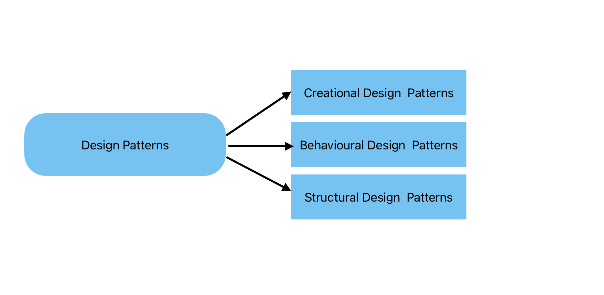

# Design-Patterns-in-Salesforce

Design patterns are essential in modern backend development as they provide a structured approach to solving common problems. The use of design patterns offers numerous advantages, including code reusability, scalability, maintainability, reduced errors, and improved performance.

Let's understand what are the type of Design Patterns.

Well we have 3 types of design patterns.

1. **Creational Design Pattern**: Creational design patterns are a category of design patterns in software engineering that deal with object creation mechanisms. These patterns abstract the instantiation process, making a system independent of how its objects are created, composed, and represented.

2. **Behavioral Design Pattern**: Behavioral design patterns are a category of design patterns that focus on how objects interact and communicate with each other. These patterns help in defining the ways in which objects cooperate to perform tasks and handle responsibilities.

3. **Structural Design Patterns**: Structural design patterns are a category of design patterns in software engineering that deal with object composition and structure. They are used to simplify the design by identifying a simple way to realize relationships between entities. 

Here we are going to see how design patterns can be used in Apex. Below are the list of design patterns that we are going use

1. Factory Method Design Pattern
2. Unit of Work (UOW) Design Pattern
3. Template Method Design Pattern